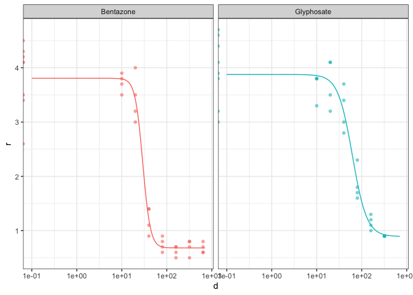

<!-- README.md is generated from README.Rmd. Please edit that file -->

# tidydrc

<!-- badges: start -->
<!-- badges: end -->

The goal of {tidydrc} is to create a programmatic, ‘tidy’ interface to
the {drc} package for fitting various dose-response models to large
amounts of experimental data.

This package leverages the `tidyr::nest()` and `purrr::map()` workflow
for keeping raw data, fitted models, predictions, and relevant model
coefficients together in a single data frame.

> This is a fork and refactor of the original
> [{tidydrc}](https://github.com/angelovangel/tidydrc) that had a
> stalled development. Credit for original creation goes to Angel
> Angelov.

## Installation

<!-- You can install the released version of {tidydrc} from [CRAN](https://CRAN.R-project.org) with: -->
<!-- ``` r -->
<!-- install.packages("tidydrc") -->
<!-- ``` -->

Install the development version:

``` r
devtools::install_github("bradyajohnston/tidydrc")
```

## Example

With a single function, we fit a `drc::L.4()` 4 parameter log-logistic
dose-response model do the example data `S.alba`.

``` r
library(tidydrc)
#> Loading required package: drc
#> Loading required package: MASS
#> 
#> 'drc' has been loaded.
#> Please cite R and 'drc' if used for a publication,
#> for references type 'citation()' and 'citation('drc')'.
#> 
#> Attaching package: 'drc'
#> The following objects are masked from 'package:stats':
#> 
#>     gaussian, getInitial
```

``` r
str(S.alba)
#> 'data.frame':    68 obs. of  3 variables:
#>  $ Dose     : int  0 0 0 0 0 0 0 0 10 10 ...
#>  $ Herbicide: Factor w/ 2 levels "Bentazone","Glyphosate": 2 2 2 2 2 2 2 2 2 2 ...
#>  $ DryMatter: num  4.7 4.6 4.1 4.4 3.2 3 3.8 3.9 3.8 3.8 ...
```

`S.alba` is data from two Herbicide treatments, and contains Dose info
as well as the ,response to the Dose (`DryMatter`),

Into the `tidydrc_mode()` function we supply the data frame, dose and
response columns, the model we wish to fit (defaults to `LL.4()`) and
and columns we wish to group by – in this case the Herbicide treatment.

``` r
fitted <- tidydrc_model(
    data = S.alba, 
    dose = Dose, 
    response = DryMatter, 
    model = drc::LL.4(), 
    Herbicide
    )

fitted
#> # A tibble: 2 × 6
#> # Groups:   Herbicide [2]
#>   Herbicide  data              drmod  resid         pred           coefs        
#>   <fct>      <list>            <list> <list>        <list>         <list>       
#> 1 Glyphosate <tibble [32 × 4]> <drc>  <df [32 × 2]> <df [680 × 5]> <tibble [4 ×…
#> 2 Bentazone  <tibble [36 × 4]> <drc>  <df [36 × 2]> <df [680 × 5]> <tibble [4 ×…
```

The result of the `tidydrc_model()` function is a `tibble` that has a
row for each group. Each column is a nested object. Associated with each
group we have the `data`, the fitted `drmod` model, the model residuals
`resid`, the fitted curve data in `pred` and the coefficients from the
model in `coefs`.

The user can use `tidyr::unnest()` to access relevant information and
create plots and tables for reporting. The convenience function
`tidydrc_plot()` is provided for quickly plotting the results. The
result can then me modified like any other {ggplot2} plot such as
`ggplot2::facet_wrap()` .

``` r
fitted %>% 
    tidydrc_plot(
        ed50 = FALSE, 
        confint = FALSE, 
        colour = ~Herbicide
    ) + 
    ggplot2::facet_wrap(~Herbicide) + 
    ggplot2::theme(legend.position = "")
#> Warning: Transformation introduced infinite values in continuous x-axis
```


